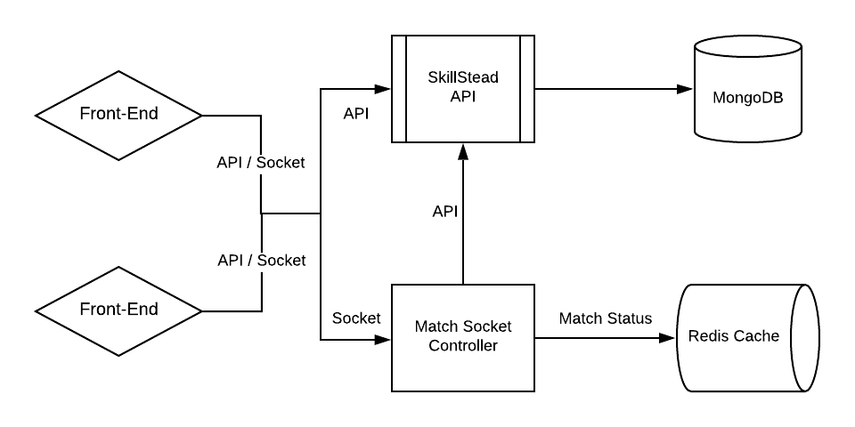

<h1 align="center">SkillStead Backend</h1>

<p align="center">
SkillStead is a multiplayer realtime quiz developed with Express.js, MongoDB, Redis and Socket.IO<br>This repository contains the Backend code providing the RESTful API and Socket connection for the <a href="https://github.com/antarikshc/SkillStead-angular">frontend</a>.
</p>
</br>

## System Design

<p align="center">

</p>

## Built With

* [Node.js](https://nodejs.org/en/) - JavaScript Runtime
* [Express](https://expressjs.com/) - Web API Framework for Node.js
* [Socket IO](https://socket.io/) - Real-time, bidirectional and event-based communication
* [MongoDB](https://www.mongodb.com/) - NoSQL Database
* [Mongoose](https://mongoosejs.com/docs/) - Object Data Modeling (ODM) library for MongoDB
* [Redis](https://redis.io/) - In-memory data structure store, used as cache

## Running the project

    $ npm start


# License
```xml
Designed and developed by antarikshc (Antariksh Chavan)

Licensed under the Apache License, Version 2.0 (the "License");
you may not use this file except in compliance with the License.
You may obtain a copy of the License at

   http://www.apache.org/licenses/LICENSE-2.0

Unless required by applicable law or agreed to in writing, software
distributed under the License is distributed on an "AS IS" BASIS,
WITHOUT WARRANTIES OR CONDITIONS OF ANY KIND, either express or implied.
See the License for the specific language governing permissions and
limitations under the License.
```
